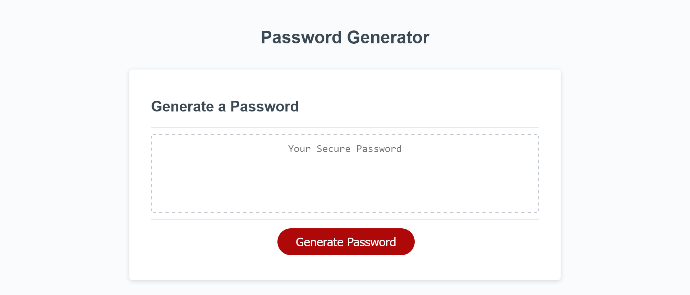
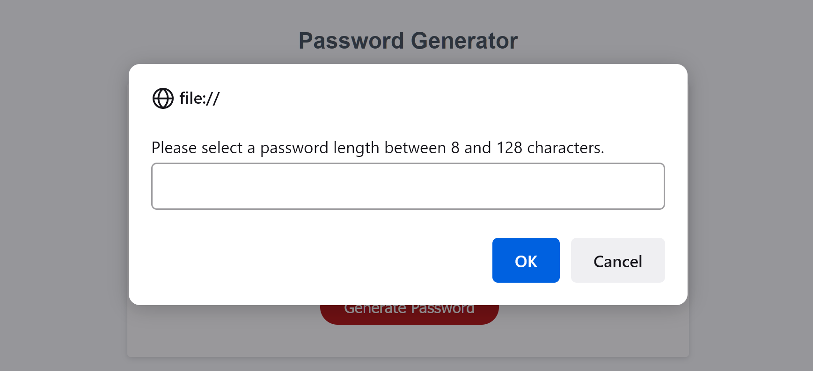

# JC--Password-Generator

## JC--Password-Generator

The motivation for this project was to create an application, that an employee can use to generate a random password based on criteria they’ve selected.

This app runs in the browser, and features dynamically updated HTML and CSS powered by JavaScript code.

## Usage

URL of the deployed application:
https://jeanj22.github.io/JC--Password-Generator/

<!-- //
randomly generate a password based on the following criteria:

    password length should be a number between 8 and 128 characters
    users could choose to include 4 types of characters (lowercase, uppercase, number and special characters) - where at least one should be selected -->

//
<!-- 
    The application first gets password criteria by prompting the user for a length, validating the response, and then confirming the desired character type(s), requiring at least one selection. These 5 criteria are all assigned to a password criteria object.
    Four functions for getting random characters (lowercase, uppercase, numeric, and special) are pushed into a choices array.
    The password criteria object and choices array are then passed as arguments in the main generateRandomPassword function which loops through the choices array based on the user's selections, pushing randomly selected characters into the password array.
    The completed password array values are then joined as a string, declared as the password variable, and written to the document's textarea.
//
 -->

## Screenshots 

Password Generator:

Prompt for user:

An example of a generated password.

## Credits

Resources consulted:

## License
N/A
